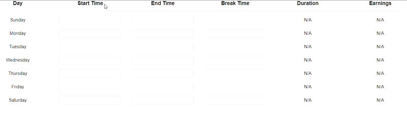

    <h1>Time Sheet</h1>
    
A less tedious method of inputting hours for freelancers

    
     

## Summary

Time Card Calculator, Time Calculator, and a bunch of other time related keywords have 100K-1M searches per month. When I was freelancing, I found the options out there to be quite inconvenient. My theory is that most people start or end at similiar times each week. The idea with this application is to speed up the process, allow users to save each week to a database, and have a clock that creates the entries for them automatically via a stopwatch.

## Notes

As I understand it, ad revenue is usually based on how long the user spends on the website, in addition to the number of visits. A time sheet application is something that would result in daily visits, while a stopwatch would result in users having the application open for many hours each day. If I make the application more convenient than the competition, then advertise it to specific audiences (freelancing subreddits, facebook groups, youtube videos related to freelancing) I would give people a tool that makes things easier for them, while also generating traffic for my website.

## Road Map & Ideas

Save user inputs for each day of the week, then make suggestions when they're typing based on their previous inputs. For example, if they've typed these inputs into the sunday start time field:

["02:45 PM", "02:45 PM", "02:45 PM" "01:00 PM", "01:00 PM", "04:40 PM", "02:45 PM"]

They would be given this list of suggestions when they focus that input (sorted from most frequent to least frequent)

"02:45 PM",
"01:00 PM",
"04:40 PM"

I'd also like to have a "Start Work" button they can press to automatically populate the start field for that day, then populate the end field for that day once they press the button again. This would result in them spending lots of time on the website.

Eventually I'd like to save all entries in a database, then give them the ability to purchase more storage space, sorting features, etc.
